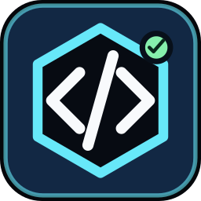

# Claude Code Monitor for Stream Deck

<p align="center">
  
</p>

Claude Code Monitor turns a Stream Deck into a status board for local [Claude Code](https://code.claude.com) sessions. Each session key shows the project name, live state, and how recently the session was active — and lights up the moment a session is **waiting on your input or a permission approval**. Tap a key to focus that session's editor window; hold it to pin the project to the key or clear a finished state.

This is an unofficial community project and is not affiliated with or endorsed by Anthropic or Elgato. It began as a hard fork of the Codex Control plugin and keeps its local-first security model.

## How it works

Claude Code [hooks](https://code.claude.com/docs/en/hooks) fire on session events (prompt submitted, notification, tool completion, stop, session end). A tiny Python helper forwards minimized, metadata-only events to the plugin over a loopback-only, token-authenticated bridge. No polling, no cloud, no prompt or response text leaves the hook payload.

```text
Claude Code session ──hook──▶ helper ──127.0.0.1+token──▶ plugin ──▶ key
                                 └──▶ local spool (when Stream Deck is closed)
```

## Features

- Keys light up **APPROVAL** (amber) or **INPUT** (yellow) when a session needs you
- Live states: `WORKING`, `APPROVAL`, `INPUT`, `DONE`, `FAILED`, `IDLE`, `ACTIVE?` (stalled)
- Freshness labels such as `UPDATED 20M`
- Tap to focus the session's VS Code window (macOS switches to its Space automatically)
- Hold to pin a project to a key, or to acknowledge a `DONE` / `FAILED` state
- **Sticky keys**: a project keeps its key while its sessions live — urgency changes color, never position
- Sessions grouped per Git project (worktrees grouped by default); multiple waiting sessions show a count badge
- Health key: bridge and hooks status, plus a warning when more sessions are waiting than keys can show
- One-click hooks installer that non-destructively merges into `~/.claude/settings.json` (with a timestamped backup)
- Atomic local cache, bounded payloads, secret-redacted logs, loopback-only bridge

## Install

### From a packaged release

1. Download `com.claudecode.monitor.streamDeckPlugin` from the repository's Releases page.
2. Double-click it and approve installation in Stream Deck.
3. Drag **Claude Session** keys into a profile and add **Monitor Health**.
4. Select any key, open its Property Inspector, and press **Install hooks**.
5. Start (or keep using) Claude Code sessions — keys update live.

### From source

Requirements: Node.js 24+, Stream Deck 7.1+, Python 3, and Claude Code.

```sh
npm ci
npm run check
npm run pack
```

Open the generated `com.claudecode.monitor.streamDeckPlugin` file to install it.

For development:

```sh
npx streamdeck link com.claudecode.monitor.sdPlugin
npm run dev
```

See [Complete setup](docs/SETUP.md) for hook installation details, key layout, troubleshooting, and uninstall steps.

## Recommended 6-key layout (Stream Deck Mini)

```text
[Session 1] [Session 2] [Session 3]
[Session 4] [Health   ] [Your key ]
```

Session keys follow physical position automatically. Projects claim keys stickily: a session keeps its key until it ends, so the key you tap to jump to a workspace never changes meaning mid-reach.

## What the labels mean

| Label | Meaning |
| --- | --- |
| `APPROVAL` | The session is waiting for a permission decision. |
| `INPUT` | The session is waiting for your next prompt or an answer. |
| `WORKING` | Claude is actively working. |
| `ACTIVE?` | The session claimed to be working but has been silent too long. |
| `DONE` | The last turn completed; hold the key to acknowledge. |
| `FAILED` | The last turn died on an API error. |
| `IDLE` | The session is open with nothing pending. |
| `SETUP` | Hooks are not installed; open the Property Inspector. |
| `BRIDGE` | The local notify bridge is not running. |
| `UPDATED 20M` | The last event from this project arrived 20 minutes ago. |

`DONE` appears after every completed response turn — it means "your move", not "project finished".

## Security and privacy

- Events carry session metadata only: session ID, working directory, event type, and notification type. Prompt text, responses, and transcript paths are never transmitted or stored.
- The notify bridge listens only on a random `127.0.0.1` port and requires a 256-bit bearer token stored in the local application-data directory.
- The hooks installer refuses to modify a `settings.json` it cannot parse, preserves all existing hooks and settings, and writes a timestamped backup first.
- The hook helper always exits 0 and times out its POST in under a second, so it can never slow down or block a Claude Code session.
- All process launches use argument arrays with `shell: false`. Logs are size-bounded and secret-redacted.

Read the [Security policy](SECURITY.md) for the threat model and reporting process.

## Development

```sh
npm run typecheck
npm test
npm run build
npm run validate
npm run security
```

See [Architecture](docs/ARCHITECTURE.md) and [Development and release](docs/DEVELOPMENT.md).

## Official references

- [Claude Code hooks reference](https://code.claude.com/docs/en/hooks)
- [Claude Code settings](https://code.claude.com/docs/en/settings)
- [Stream Deck SDK getting started](https://docs.elgato.com/streamdeck/sdk/v1/introduction/getting-started/)
- [Stream Deck plugin packaging](https://docs.elgato.com/streamdeck/cli/commands/pack/)

## License

[MIT](LICENSE)
