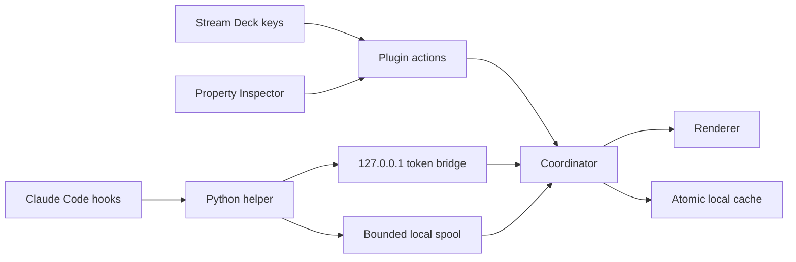

# Architecture

## Components

The plugin process is the only long-running component. There is no polling and no control connection to Claude Code: every state change is pushed by a hook. The only timer is a 60-second garbage-collection tick that expires sessions that died without a `SessionEnd` (crash, kill) and flags stalled work.

## Event pipeline

Eight Claude Code hook events are installed (`SessionStart`, `UserPromptSubmit`, `Notification`, `PreToolUse`, `PostToolUse`, `Stop`, `StopFailure`, `SessionEnd`). `PreToolUse` is the only scoped entry: it carries the matcher `AskUserQuestion|ExitPlanMode`, because those tools park a session waiting on the user without emitting any notification, and a matcher-less `PreToolUse` would fire on every tool call. The helper reads the hook payload from stdin, keeps only metadata (session ID, cwd, event type, notification type, bounded message, and — for `pre-tool` only — the tool name), stamps it, and POSTs it to the bridge with a 0.75 s timeout. On failure it spools the event atomically to a local directory — except `post-tool` events, which are high-volume and worthless when stale. The helper always exits 0 so hooks never slow a session down.

The bridge validates every request: POST to `/event` only, bearer token, `application/json`, loopback remote address, 256 KiB body cap, and a strict allow-list reconstruction of the event (`version === 2`, known type, ID grammar, absolute NUL-free cwd). The spool drain applies the same validation and caps at 500 files per pass.

## Session state machine

`src/session-model.ts` is a pure module (fully unit-tested) that folds events into per-session phases:

| Event | Transition |
| --- | --- |
| `session-start` | new session → `idle`; `clear`/`startup` resets, `compact`/`resume` keeps the current phase |
| `prompt-submit` | → `working` |
| `notification` | `permission_prompt` → `needs_approval`; passive types (e.g. `auth_success`) no change; everything else → `needs_input` |
| `pre-tool` | `AskUserQuestion`/`ExitPlanMode` → `needs_input` (`question_prompt`); any other tool behaves like `post-tool` |
| `post-tool` | `needs_approval`/`needs_input`/`idle` → `working` (proof the request was resolved) |
| `stop` | → `done` |
| `stop-failure` | → `failed` |
| `session-end` | session removed, key freed |

Any event for an unknown session upserts it first, so a plugin restart mid-session recovers. GC marks `working` sessions with no events for `staleWorkingMinutes` as `ACTIVE?` and deletes sessions silent for `sessionTtlHours`.

## Project grouping

Sessions are grouped by canonical Git identity: resolve the session cwd, use the repository top level, and (when worktree grouping is on) anchor on the Git common directory; the SHA-256 of the anchor is the project ID. Each project's primary session is chosen by urgency (`needs_approval` > `needs_input` > `failed` > `working` > `done` > `idle`), tie-broken by recency.

## Sticky slot assignment

Keys map to projects through a persisted slot map (`cache.slots`), not a sorted list:

1. A project keeps its slot while it stays underway.
2. A slot is freed when its project's sessions all end or expire.
3. New projects claim the lowest free slot below `autoSlotCount`.
4. When all slots are full, only a project that needs attention may evict — and only an `idle` or `done` project, never working or attention-needing ones. Overflow is surfaced on the Health key instead.

Urgency changes color, never key position: a key is a muscle-memory pointer to a workspace. Keys can also be pinned to a project root (hold gesture or Property Inspector), which overrides the map.

## Rendering

Key images are generated as SVG and sent as encoded data URLs. Every user-derived string is stripped of control characters and XML-escaped. Renders are debounced (100 ms) and deduplicated. The display ladder puts setup problems first: hooks missing → `SETUP`, bridge down → `BRIDGE`, then the session phase.

## Hooks installer

The Property Inspector's **Install hooks** button merges command entries into `~/.claude/settings.json`. The merge is idempotent and non-destructive: it recognizes its own entries by the helper filename, updates them in place, preserves all user hooks and unrelated keys, refuses to touch a file it cannot parse, backs up first, and writes atomically. Uninstall removes only our entries and prunes empty groups.

## Persistence

The cache (schema v2: sessions, derived projects, slot map) uses a 10 MiB limit, an exclusive temporary file, `fsync`, atomic rename, and a last-known-good copy. It persists on phase changes and membership changes, not on every activity bump. Logs rotate at 1 MiB and redact common API-key, bearer-token, and query-secret patterns.

## Process launches

Editor and OS launches use `spawn` with argument arrays and `shell: false`. The tap gesture launches the configured editor (default `code`) against the primary session's real cwd, which focuses the existing VS Code window for that folder and lets macOS switch Spaces.
